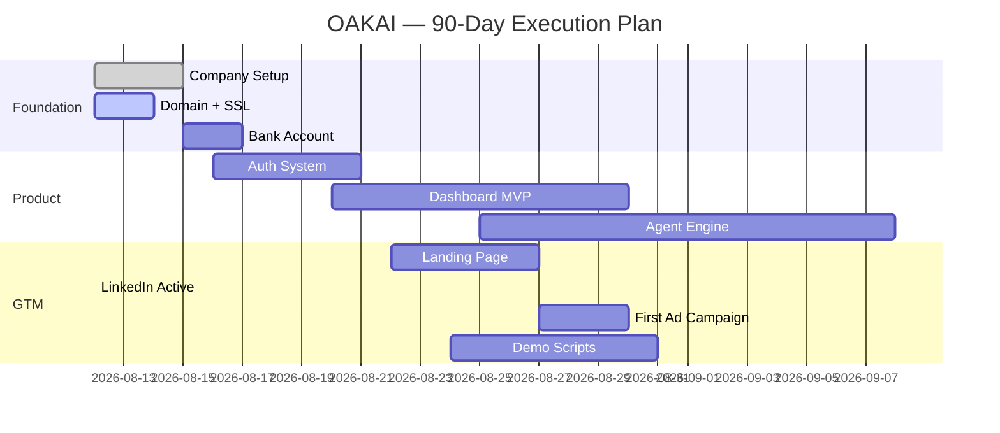

# 🌳 OAKAI — AI Solutions Provider OS  
*A living command center for AI transformation*

> **Purpose**: Central hub to track AI skills growth, business execution, and marketing momentum  
> **Update rhythm**: Auto-fed by crons (`mentor-ai-daily`, `strategic-coo-guidance`, `marketing-advisor-daily`)

---

## 🧭 Dashboard Overview (Quick Stats)

| Metric | Current | Target | Due |
|--------|---------|--------|-----|
| Company registered | ⬜ | ✅ SSM filed | W1-D3 |
| Domain acquired | ⬜ | ✅ oakai.com.my | W1-D2 |
| Landing page live | ⬜ | ✅ MVP | W3 |
| First demo script | ⬜ | ✅ Manufacturing | W3 |
| First client call | ⬜ | ✅ 1 booked | W4 |

---

## 🏢 Company Setup

### SSM Registration Checklist
- [ ] Reserve company name (OAKAI) — submit via SSM e-Lodgement
- [ ] File incorporation documents
- [ ] Receive RO (Registration Certificate)
- [ ] Register GST (if turnover > RM500k projected)

### Domain + Hosting
- [ ] Register oakai.com.my (via Exabytes/OnlineNIC)
- [ ] Set up DNS records (A, CNAME, MX)
- [ ] Provision VPS (DigitalOcean/AWS EC2)
- [ ] Install Nginx + SSL (Let's Encrypt)

### Banking
- [ ] Open business current account
- [ ] Apply for business credit card
- [ ] Link to accounting software (Wave/Zoho Books)

---

## 🧠 Mentor AI Learnings

### Current Track
```text
Stage: Foundations → Agent Orchestration → Security → Scaling → IP Protection
Focus: 3x daily lessons (07:00 / 15:00 / 22:00 MYT)
```

### Student Profile
```yaml
Stage: 2/9  # Foundations
Concept Mastery:
  - Prompt Engineering: High
  - Agent Loops: In Progress
  - Guardrails/RBAC: Not Started
  - Data Isolation: Not Started

Testing History:
  - 2026-08-11: Tool Use vs Agentic → Passed
  - 2026-08-12: Prompt Injection Defense → Pending
```

### Daily Lessons
| Date | Time | Concept | Status |
|------|------|---------|--------|
| 2026-08-11 | 07:00 | AI Agents | Done |
| 2026-08-11 | 15:00 | Tool Calling | Done |
| 2026-08-11 | 22:00 | Guardrails | Done |
| 2026-08-12 | 07:00 | Prompt Injection | Scheduled |

### Concept Index
| Concept | Tags | First Taught | Mastery |
|---------|------|--------------|---------|
| LLM Agents | agent, basics | 2026-08-11 | High |
| Tool Use | workflow, tools | 2026-08-11 | Medium |
| Guardrails | security, rbac | 2026-08-11 | Low |

---

## 📊 COO Strategy

### 90-Day Roadmap



### Weekly Briefs
| Week | Theme | Status | Link |
|------|-------|--------|------|
| W32 | Foundation Setup | In Progress | coo-brief-2026-W32.md |

### Budget Planner
| Category | Monthly | Burned | Remaining |
|----------|---------|--------|-----------|
| Domain | RM15 | RM0 | RM15 |
| VPS | RM80 | RM0 | RM80 |
| Marketing | RM100 | RM0 | RM100 |
| Total | RM195 | RM0 | RM195 |

### Vendor Tracker
| Vendor | Service | Cost | Status |
|--------|---------|------|--------|
| Exabytes | Domain | ~RM15/yr | Pending |
| DigitalOcean | VPS | ~RM80/mo | Pending |
| Notion | Workspace | Free | Active |

### Risk Register
| Risk | Likelihood | Impact | Mitigation |
|------|------------|--------|------------|
| Domain taken | Low | High | Check within 24h |
| SSM delay | Medium | Medium | File early, follow up |
| No clients W1 | High | Medium | Lead with case studies |

---

## 📈 Marketing Engine

### UVP (Unique Value Proposition)
> "OAKAI: AI agents that automate manufacturing, retail, and service operations — with military-grade data isolation and compliance built-in from day one."

### Target Personas
1. **Manufacturing Ops Head** — reduce downtime, predictive maintenance
2. **Retail Store Manager** — optimize staffing, inventory forecasts
3. **F&B Kitchen Manager** — food waste reduction, shift planning

### LinkedIn Content Calendar
| Date | Post Idea | Status |
|------|-----------|--------|
| Aug 12 | "Why I left traditional ERP for AI agents..." | Drafted |
| Aug 13 | "Day-in-the-life: An AI ops agent at work" | Pending |
| Aug 14 | "Data isolation: why it matters in AI tools" | Pending |

### Lead Magnets
| Title | Format | Gate? |
|-------|--------|-------|
| "AI Ops Audit Checklist" | PDF | Yes |
| "ROI Calculator for AI Agents" | Tool | Yes |

### Ad Campaigns
| Campaign | Platform | Budget | Status |
|----------|----------|--------|--------|
| AI Ops Awareness | LinkedIn | RM50 | Planned |

### Messaging Library
| Hook | Use Case |
|------|----------|
| "Stop losing production hours to manual workflows" | Manufacturing |
| "Know what to restock before shelves go empty" | Retail |
| "Reduce food waste by 20% with smart forecasting" | F&B |

---

## 🛠️ Product Development

### Tech Stack
```yaml
Frontend: React + Tailwind
Backend: FastAPI (Python)
Database: PostgreSQL + Redis
LLM Provider: Nous Portal (hy3/laguna)
Agent Framework: LangGraph
Auth: Clerk.dev or Supabase Auth
Hosting: Docker on VPS
```

### Feature Backlog
| Feature | Priority | Effort | Status |
|---------|----------|--------|--------|
| Dashboard UI | P1 | 2d | ⬜ |
| Auth Flow | P0 | 1d | ⬜ |
| RBAC System | P0 | 3d | ⬜ |
| Data Isolation | P0 | 2d | ⬜ |
| AI Agent Engine | P1 | 5d | ⬜ |

### Architecture Docs
- `poc-architecture.md` (WIP)
- `data-isolation-spec.md` (pending)

### Pilot Pipeline
| Client | Industry | Stage | Next Step |
|--------|----------|-------|-----------|
| (None yet) | — | — | Book first demo call |

---

## 🔄 Automation Integration
This workspace is fed by three crons:
- `mentor-ai-daily` → `/knowledge/mentor/` → Daily Lessons, Student Profile
- `strategic-coo-guidance` → `/knowledge/strategy/` → Weekly Briefs, Budget updates
- `marketing-advisor-daily` → `/knowledge/marketing/` → Daily Briefs, LinkedIn calendar

Manual sync required until Q4 2026 for Notion ↔ Cron linkage.
