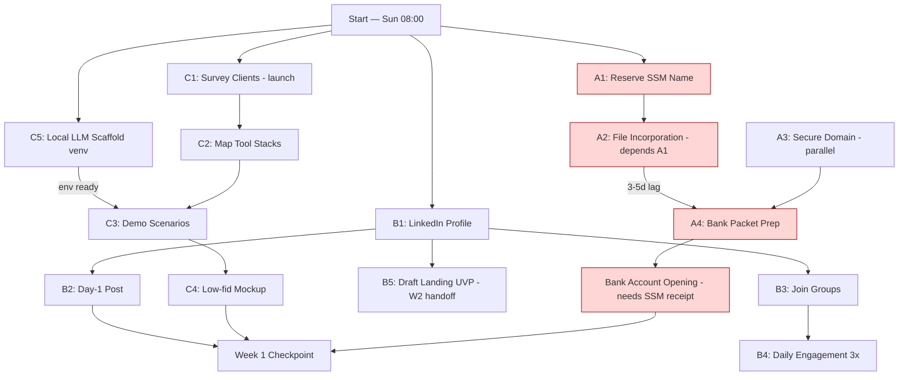

# 📊 COO Brief — Week 1 (2026-08-12, WW32)
*OAKAI SDN BHD — AI solutions provider, bootstrap phase*

> **Verdict (TL;DR):** Week 1 is a 3-stream parallel sprint. Legal incorporation is the hard gate — nothing else signs until SSM receipt lands. Marketing and product-discovery run concurrently against free tiers + local LLM (Qwen2.5-1.5B) so zero paid APIs are touched. Net cash out this week: **RM155 core (name + incorporation + domain)**; optional buffer RM45. Cap: **RM200**.

> **Next briefing:** Sunday 2026-08-19 08:00 MYT — Week 2 COO Brief
> **Deliver by:** `strategic-coo-guidance` cron (Sundays 08:00 MYT) → `/opt/data/knowledge/strategy/`

---

## 1️⃣ WEEK 1 OBJECTIVES (REALISTIC, PARALLEL-EXECUTABLE)

Three independent streams. Only Stream A is sequential-critical; B and C must deliver measurable outputs even if A slips (but no client contract is signed without A done).

### Stream A — Legal & Entity (BLOCKER)
| # | Task | Owner | Cost | Days |
|---|------|-------|------|------|
| A1 | Reserve SSM name "OAKAI" (+2 backups) via e-Lodgement | Founder | RM30 | 1 |
| A2 | File private-limited incorporation | Founder | RM110 | 3-5 |
| A3 | Secure domain `oakai.com.my` (backup `theoakai.com.my`) | Founder | RM15 | 2h |
| A4 | Prep bank-opening packet (SSM receipt, IC, draft deed, COO Brief) | Founder | — | day 4 |
| A5 | Draft simple service-agreement + NDA template (local LLM) | Founder | — | day 3-5 |

**Why first:** No client signs with an unregistered entity. No bank account without SSM proof. Marketing spend without legal = waste.

**Parallel enabler:** While SSM processes (3-5 day lag), founder drafts website copy, LinkedIn creds, and contract templates using **local Qwen2.5-1.5B** — avoids burning free-tier RPM.

### Stream B — Marketing & Positioning (free-tier/organic)
| # | Task | Owner | Cost | Days |
|---|------|-------|------|------|
| B1 | LinkedIn profile: headline + summary + banner | Founder/Marketing-cron | — | 1 |
| B2 | Publish Day-1 post: "Why I left traditional ERP for AI agents" (case hook) | Marketing-cron | — | 1 |
| B3 | Join 5 relevant groups (AI Malaysia, MFG Ops, Retail Ops Asia, F&B Tech, SME Digital) | Founder | — | 1 |
| B4 | Meaningful engagement: 3 posts/day, human-first (no bots) | Founder | — | 7 |
| B5 | Draft landing-page UVP + value props (ready for W2 dev) | Marketing-cron | — | 5 |

**Daily cadence (from `marketing-advisor-daily` cron, Mon-Sat 06:00 MYT):**
- 1 caption ready to post
- 1 group join / post target
- 1 landing-page tweak suggestion

### Stream C — Product Discovery & POC Scaffold (local-first)

> **Flagship asset already proven — lead with it, don't bury it.** OAKAI's Document Reader Agent (fully local PII/PHI redaction, standalone server, **18/18 tests passing**) is a *running system*, not slideware. Package it as the lead proof-point this week: it is the concrete, defensible answer to the "can an agent safely touch our data?" objection every enterprise client raises, and it should anchor every discovery call. Treat C1–C5 below as validation/scaffold built *around* this asset — not as the only thing we have to show.

| # | Task | Owner | Cost | Days |
|---|------|-------|------|------|
| C1 | Survey 3 target clients (1 mfg, 1 retail, 1 F&B) — pain-points + tools used | Founder | RM60 incentive | 5 |
| C2 | Map current tool stacks (Excel→SAP→custom) → gap analysis | Founder | — | 4 |
| C3 | Draft 3 demo scenarios from real responses | Founder | — | 5 |
| C4 | Low-fid mockup (Figma screenshot walkthrough) | Founder | — | 6 |
| C5 | Scaffold local POC env: Python venv + Qwen2.5-1.5B + bge-m3 (no egress) | Ops | — | 3 |

**Why now:** Avoid building features nobody wants. Customer pain = feature spec. Local stack guarantees no Egress dependency (HF DNS-blocked, Groq/Nous WAF-throttled).

---

## 2️⃣ ACTION SEQUENCE DIAGRAM

*Red = legal-blocker chain. Blue/green = parallel tracks deliverable independently.*

**Critical path:** A1 → A2 → A4 → Bank (3-5 days, SSM-dependent). Everything else is parallel.

---

## 3️⃣ BUDGET ALLOCATION (MYR, REALISTIC)

| Item | Cost (RM) | Justified By | Tier |
|------|-----------|--------------|------|
| SSM name reservation | 30 | Legal blocker — non-negotiable | Core |
| SSM incorporation (private limited) | 110 | Legal blocker — company cannot exist without | Core |
| Domain `oakai.com.my` (1yr) | 15 | Brand identity — client trust | Core |
| Survey incentive (3 × 3× e-gift) | 60 | Product discovery — validated demand is cheaper than wrong build | Core |
| **Subtotal core** | **215** | | |
| Contingency buffer | 45 | Slack for domain renewal / SSM add-ons | Optional |
| LinkedIn Premium (defer to W2) | — | Organic reach + free tiers suffice W1 | **Deferred** |
| Paid API trials (defer) | — | Nous ~50RPM, OR 50/day, local LLM ready — no approval needed yet | **Deferred** |
| **W1 cash max** | **260** | Core + buffer; optional items skipped | |
| **W1 cash floor** | **215** | Core only — legally + operationally viable | |

**Constraint note:** Free-tier AI (Nous Portal `poolside/laguna-s-2.1:free`, OpenRouter 50/day, NIM one-time credit) + local `Qwen2.5-1.5B` cover all W1 synthesis, copy, and contract drafting. No paid LLM call is made without founder approval. Egress reality (HF DNS-blocked, Groq/Cerebras behind Cloudflare WAF) makes local-first mandatory for any POC dev.

---

## 4️⃣ RISK MITIGATION

| Risk | Impact (H/M/L) | Probability (H/M/L) | Mitigation |
|------|----------------|--------------------|------------|
| SSM name "OAKAI" rejected | H | M | File 2 backups in same batch; have 3rd-party ready |
| Domain `oakai.com.my` already taken | H | M | Check live now → backup `theoakai.com.my` queued |
| No survey client responds | M | M | Lead with personal network; RM60 incentive across 3 clients = RM20 each is credible |
| Free-tier LLM throttled (Nous ~50RPM) | M | H | Batch AI work offline; local Qwen2.5-1.5B + bge-m3 is the primary writer this week |
| Egress blocked (Groq/Cerebras WAF, HF DNS) | M | H | All dev/POC runs on local Qwen2.5-1.5B; cloud AI only via approved free tiers |
| Bank account delay (waiting on SSM proof) | H | M | Prep complete packet day 4; use founder personal account as bridge (tagged, tracked, zero client funds commingled) |
| LinkedIn shadow-banned (organic only) | L | M | Space posts, avoid hashtag spam, engage human-first; defer paid boost to W2 |

---

## 5️⃣ SUCCESS METRICS (BASELINE vs TARGET)

| Metric | Baseline (start of W1) | Target (end of W1) | Status signal |
|--------|------------------------|--------------------|---------------|
| Company status | Unnamed | SSM receipt issued | Green = A1+A2 started |
| Domain | Unregistered | Paid + DNS configured | Green = A3 done |
| Bank account | None | Prep packet complete (docs ready) | Green = A4 done; open = W2 |
| LinkedIn followers | 0 | 50+ (organic) | Green ≥ 30; Yellow = <30 |
| LinkedIn posts published | 0 | 3 quality posts | 1 on day 1, 1 mid-week, 1 wrap |
| Groups joined | 0 | 5 joined, 15 meaningful engagements | B4 cadence met |
| Client surveys completed | 0 | 3 completed (mfg/retail/F&B) | Green = C1 done |
| Demo scenarios drafted | 0 | 3 written + 1 low-fid mockup | C3+C4 done |
| Local LLM scaffold | None | Qwen2.5-1.5B + bge-m3 inference running | C5 done |
| Flagship Doc-Reader asset | Built & verified (18/18) | Demo-packaged + cited as lead proof in B2/B5 | Running system, not slideware |
| Free-tier AI cost | — | RM0 (local/organic only) | No paid API touched |
| Total W1 cash | — | ≤ RM215 core (floor) / RM260 max (cap) | Budget held |

**Pass threshold for Week 1:** A1+A2+A3 landed, C5 scaffold running, 1 survey done, Day-1 post live, 30+ LinkedIn followers. Anything less = Week 2 scope contraction.

---

## 6️⃣ NEXT WEEK (W2) AGENDA PREVIEW

Subject to W1 outcomes — currently planned:
1. **Bank account live** + founder draws no salary (reinvest surplus)
2. **Landing page** build — GitHub Pages (free) or free-tier VPS; auth via **free-tier Clerk dev mode** (defer Supabase paid tier until revenue)
3. **Local LLM integration** validated against PENSOLAR anomaly-flagging demo (Qwen2.5-1.5B serves inference, bge-m3 for retrieval)
4. **First demo script** (real-time production anomaly flag) tested end-to-end on free tiers
5. **Revenue gate review** — decide whether ANY paid API (Gemini/DeepSeek direct) is justified; requires explicit founder approval + budget line

---

## 🔄 AUTOMATION FEEDBACK LOOP

This COO brief is produced by:
- `strategic-coo-guidance` cron → Sundays 08:00 MYT → `/opt/data/knowledge/strategy/`
- Index updated: `/opt/data/workspace/INDEX.md`
- Next brief auto-scheduled: **2026-08-19 08:00 MYT**
- W1 progress checkpoint (lighter) auto-scheduled: **2026-08-15 08:00 MYT** mid-week pulse

---

*Prepared by Hermes Agent — AI Strategy Co-Pilot for OAKAI. Operating on free-tier infra only (Nous Portal `poolside/laguna-s-2.1:free`, local `Qwen2.5-1.5B` + `bge-m3`). Egress to Groq/Cerebras and HuggingFace is blocked/waf-throttled by the environment; all deliverables are reproducible on the local stack.*
